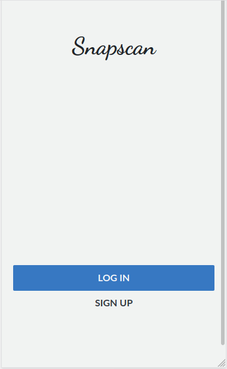

# Expense Tracker W

This is a web app for mobiles created to track your expenses. It includes an extra feature to track your expenses monthly with its proper information as :spend per day, :most expensive object, and :total. 

> This repo includes the code for the Expenses Tracker. User could download the code and use it to generate a new app with new properties as the user could want.



## Description of the project video
You can watch a video with a brief description of the project explaining how I handled n+1 problem. Also with a brief look at the project pages.

[Video-loom](https://www.loom.com/share/9fe68b9e91ac41558ee5e1cf52d47662)

## Built With

- Ruby v2.6.5
- Ruby on Rails v5.2.4
- Bootstrap

## Live Demo

- Heroku App.

You can click on this [link](https://expense-tracker-emi.herokuapp.com/)


## Getting Started

To get a local copy up and running follow these simple example steps.

-[x] 1.- Click on the install or download button under the repository name and copy the URL by clicking on the icon.


-[x] 2.- Open your terminal. To open the terminal, press Ctrl+Alt+T(Ubuntu) or if you are using Mac Command + Space and type in 'Terminal'.


-[x] 3.- Navigate to the location in your computer where you want the repo to be cloned. Remeber that you have to type 'cd' first.


-[x] 4.- Type git clone and paste the url you copied on step one.


### Prerequisites

Ruby: 2.6.3
Rails: 5.2.3
Postgres: >=9.5

### Setup

> Remember that you need install all the gems before trying to run the program. It's very important to follow the next instructions.

Instal gems with:

```
bundle install
```

Setup database with:

```
   rails db:create
   rails db:migrate
```

### Usage

Start server with:

```
    rails server
```

Open `http://localhost:3000/` in your browser.

### Run tests

```
    rpsec --format documentation
```

> I've added tests for the user, expenses and groups models. Checking out the proper functionality of creating new groups, expenses and checking its valid attributes. There's been added more test for views functionality in users and for good functionality in routes.


### Deployment

To deploy this repo, we used Heroku web app. We created a new app named 'social-media-bru-emi' to deploy the content, and migrated the PostgresQL database using 'heroku run rails db:migrate' command.

> You can access to the deployed app following this [link](https://expense-tracker-emi.herokuapp.com/)

## Authors

👤 **Emilio Contreras**

- Github: [@emiliocm9](https://github.com/emiliocm9)
- Twitter: [@emiliocm31](https://twitter.com/emiliocm31)
- Email: [email](emilio.contreras97@gmail.com)

## 🤝 Contributing

Contributions, issues and feature requests are welcome!

Feel free to check the [issues page](issues/).

## Show your support

Give a ⭐️ if you like this project!

## Acknowledgments

- Project inspired by Microverse Program.
- Design inspired by Greoire Vella. You can find his work in the next link
[behance](https://www.behance.net/gallery/19759151/Snapscan-iOs-design-and-branding?tracking_source=)
